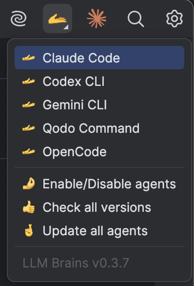

# LLM Brains

"LLM Brains" is a JetBrains IDE plugin (for e.g. usage in PhpStorm) to open any (popular) CLI coding agent in a new terminal window.
Tested with PhpStorm 2025.2.1 (Build #PS-252.25557.128) and requires the 252.* platform family.
It's like the Claude Code button but also provides OpenAI Codex and Google's Gemini CLI, and maybe more in the future.

It shows the 🫴 icon in the top right corner of the IDE.
When you click on it, it gives you the following options:

* "Claude Code" ⇒ run 'claude' in an IDE terminal window with title '🫴 Claude'
* "Codex CLI" ⇒ run 'codex' in an IDE terminal window with title '🫴 Codex'
* "Gemini CLI" ⇒ run 'gemini' in an IDE terminal window with title '🫴 Gemini'
* "Qodo Command" ⇒ run 'qodo' in an IDE terminal window with title '🫴 Qodo'
* "Check what's installed" ⇒ run a bash script in an IDE terminal window: for each of the CLI programs above: if it's installed, show the version. If it's not, show how to install it.
